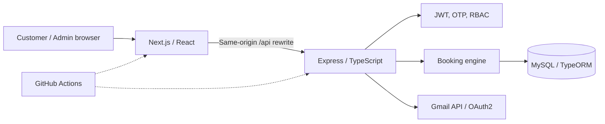

# Serpente Nail Room — Full-stack Appointment Booking System

<p align="center"></p>

**A deployed nail salon booking platform with concurrency-safe staff allocation, account security, and an administrative dashboard.**

[**Live website**](https://nail-salon-web-v2.vercel.app/) · [**Service catalog**](https://nail-salon-web-v2.vercel.app/services) · [**API health**](https://api-production-e911.up.railway.app/health) · [**Technical documentation**](docs/README.md) · [**Engineering case study**](docs/PORTFOLIO.md) · [**Product tour**](docs/DEMO.md)


## Problem and approach

A salon with multiple employees must let customers find bookable times without selecting an employee. Two customers may attempt the same time simultaneously, so simply displaying an available slot and checking again with a SQL `SELECT` is not sufficient to prevent double booking. The system must also support multi-person reservations and give administrators an operational workflow.

**The solution:** A Next.js frontend backed by an Express + MySQL API. The backend calculates available times, chooses eligible free staff, and atomically reserves each required 15-minute interval before committing an appointment or group booking.

## Features

| Customer experience | Staff / admin operations |
|---|---|
| Browse salon information, promotions, branches, service prices | Maintain services, branches, employees, promotions and database-hosted website photos |
| Register/login with email OTP and trusted-browser recognition | View a dashboard and manage appointment states |
| Select services, party size, date and **available time** | Search all appointments by date range, branch, status or customer-facing booking code |
| Book without choosing staff; receive confirmation code | Receive Gmail notification for a new booking |
| Review personal appointment status | View assigned appointments according to server-side role rules |

**Application:** [Homepage](https://nail-salon-web-v2.vercel.app/) · [Services](https://nail-salon-web-v2.vercel.app/services) · [Booking](https://nail-salon-web-v2.vercel.app/book) · [Admin](https://nail-salon-web-v2.vercel.app/admin/login). Booking and management features are accessible to authenticated users with the appropriate role.

## Architecture



| Layer | Technology |
|---|---|
| Web | Next.js 16 App Router, React 19, TypeScript, Tailwind CSS 4 |
| API | Node.js, Express 5, TypeScript |
| Persistence | MySQL 8, TypeORM, versioned migrations |
| Security | JWT access tokens, refresh-token rotation/reuse detection, email OTP, account-scoped trusted-browser cookies, RBAC |
| Integration | Gmail API via OAuth2 |
| Delivery | GitHub Actions CI, Vercel (web), Railway (API); alternative VPS/Docker Compose configuration |

## Engineering highlights

### Preventing double booking

Availability is a read-only estimate: two clients can see the same slot. During booking, the API starts a **database transaction**, locks the requesting customer's row, checks eligible staff, then inserts all required records in `staff_booking_slots`. Its **composite primary key `(staff_id, slot_start)`** prevents concurrent transactions from reserving the same staff interval. If the staff allocation fails, the booking transaction rolls back.

For multi-person bookings, a single `booking_group_id` links one appointment per assigned staff; the group is saved atomically. The client never chooses staff.

**Source:** [booking service](src/modules/appointments/appointments.service.ts) · [slot entity](src/modules/appointments/staff-booking-slots.entity.ts) · [booking specification](docs/BOOKING.md).

### Authentication across multiple accounts

Admin/customer login uses email OTP on unrecognized browsers. The application issues short-lived JWTs and rotates refresh tokens, with reuse detection. Trusted-browser proof cookies are **scoped per account** so logging into account B does not overwrite account A's remembered-browser proof.

**Source:** [user authentication](src/modules/users/users.controller.ts) · [trusted-device logic](src/modules/users/trusted-login-device.logic.ts) · [security documentation](docs/AUTH-SECURITY.md).

### Operational booking visibility

The admin appointments table supports date-range filters and customer-visible 8-character booking-code search on the **database side**, combined with status/branch and server-side pagination. Admin status transitions are validated on the server; e.g., a confirmed appointment cannot start before its scheduled time.

**Source:** [admin dashboard](frontend/src/components/admin/AdminDashboard.tsx) · [API contract](docs/API.md).

## Design decisions

| Decision | Rationale | Trade-off |
|---|---|---|
| Unique staff/15-minute slot key | Atomic conflict detection independent of frontend timing | Extra reservation rows; updates must release/reacquire slots |
| Automatic staff assignment | Simple customer UX and central scheduling rules | Availability depends on current staff and active bookings |
| One row per person in group booking | Staff-specific assignments with shared group ID | Group views must aggregate or identify `booking_group_id` |
| Snapshot service price/name at booking | Historical bookings remain meaningful after catalog edits | Intentional duplication |
| Gmail notifications after DB commit | Email outages do not roll back valid bookings | **Best-effort delivery:** no persistent retry/outbox yet |
| JWT + rotating refresh sessions | Short-lived access credentials and revocable sessions | Additional state and cookie/origin management |

The current implementation focuses on appointment scheduling rather than online payments or employee-specific shift planning. Technical analysis and design constraints are covered in the [engineering case study](docs/PORTFOLIO.md).

## Live application

| Area | URL | What it provides |
|---|---|---|
| Salon homepage | [Open](https://nail-salon-web-v2.vercel.app/) | Branch information, promotions, gallery and customer reviews |
| Service catalog | [Open](https://nail-salon-web-v2.vercel.app/services) | Services grouped by category with pricing |
| Appointment booking | [Open](https://nail-salon-web-v2.vercel.app/book) | Service selection, available time slots and booking confirmation (login required) |
| Admin dashboard | [Login](https://nail-salon-web-v2.vercel.app/admin/login) | Booking management, search, filters and business data (admin access required) |

See the [product tour](docs/DEMO.md) for the principal user journeys.

## Getting started

Requirements: **Node.js 22+**, npm, Docker Compose v2. See [detailed setup](docs/SETUP.md).

```bash
git clone https://github.com/hello1224354/nail_salon_api.git
cd nail_salon_api
cp .env.example .env
# Set DB_PASSWORD and a strong JWT_SECRET in .env
docker compose up -d
npm ci
npm run dev
```

In a second terminal:

```bash
cd frontend
cp .env.example .env.local
npm ci
npm run dev
```

Frontend: http://localhost:3001 · Backend: http://localhost:3000 · Health: http://localhost:3000/health. Email OTP requires separate Gmail OAuth configuration; never commit credentials.

## Verification

```bash
# Repository root
npm run typecheck
npx tsx --test src/tests/trusted-login-device.test.ts
npx tsx --test src/tests/booking-notification.test.ts
npx tsx --test src/tests/admin-appointment-filters.test.ts
npm run build
# Real MySQL 8 integration suite runs in GitHub Actions using an isolated database

# Frontend
cd frontend
npx tsc --noEmit
npm run build
```

The [GitHub Actions workflow](.github/workflows/security-hardening-ci.yml) also provisions an isolated MySQL 8 instance for **16-request booking contention**, group atomicity, transaction rollback and adjacent-slot regression tests. Backend/frontend builds, dependency audits and frontend CSP checks run alongside it.

**Deep dives:** [API](docs/API.md) · [DB schema](docs/DATABASE.md) · [Booking rules](docs/BOOKING.md) · [Security](docs/AUTH-SECURITY.md) · [Deployment](docs/DEPLOYMENT.md) · [Operations](docs/TESTING-OPERATIONS.md).

