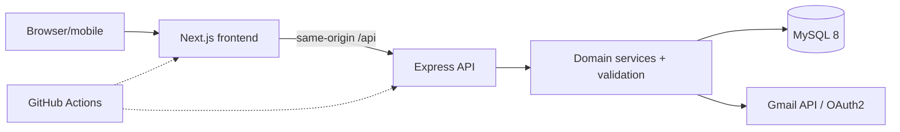
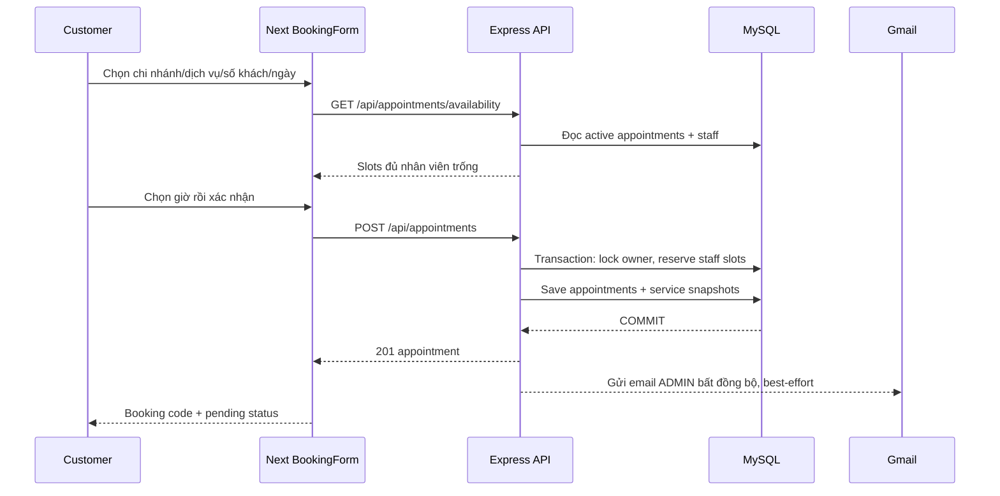
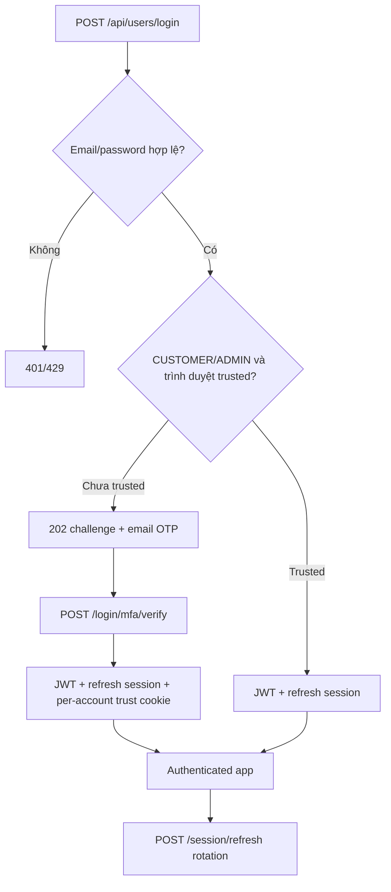

# ARCHITECTURE — Kiến trúc ứng dụng

## Tổng thể

Frontend triển khai trên **Vercel**, backend trên **Railway**. Trình duyệt gọi endpoint cùng origin `/api/...`; Next.js rewrite request sang origin cấu hình bởi `NEXT_PUBLIC_API_BASE_URL`. Express cung cấp `GET /health` cùng các namespace `/api/{users,appointments,services,staffs,branches,offers,site-content}`.

## Phân tầng & đường dẫn source

| Lớp | Source | Trách nhiệm |
|---|---|---|
| UI/routes | `frontend/src/app`, `frontend/src/components` | Next App Router, forms, interactive state |
| Client API/session | `frontend/src/lib/api.ts`, `frontend/src/lib/auth.ts` | typed responses, JWT in-memory, refresh |
| UI security | `frontend/src/proxy.ts`, `frontend/next.config.ts` | CSP nonce, headers, same-origin rewrite |
| HTTP entry | `src/app.ts`, `src/server.ts` | security headers, CORS, JSON body, DB init, migrations guard |
| Middleware | `src/common/middleware` | authentication, RBAC, origin, limits, audit |
| Domain boundary | `src/modules/{domain}` | `.routes`, `.controller`, `.dto`, `.service`, `.entity` |
| Persistence | `src/config/database.ts`, `src/migrations` | MySQL datasource, entities, migrations/seed |
| Jobs | `src/jobs/retention-cleanup.ts` | xóa records security hết hạn theo policy |

Modules: `users` (auth, OTP, Gmail), `appointments` (availability/booking/trạng thái), `branches`, `services`, `staffs`, `offers`, `site-content`, `audit`.

## Luồng tạo booking

API luôn **kiểm tra lại availability khi ghi** vì danh sách khung giờ có thể cũ ngay sau khi đọc. Không có buffer trước/sau lịch. Một booking nhóm tạo một appointment trên mỗi nhân viên tự gán.

## Luồng đăng nhập

`staff` không dùng nhánh OTP cho admin/customer trong `loginUser`. Trusted browser cookie được phân chia theo tài khoản; logout chỉ thu hồi refresh session, không có chức năng xóa toàn bộ trust trên cùng máy.

## Database và thời gian

- TypeORM entities quản lý users/staffs/branches/services/offers/site content/booking/auth/audit.
- Booking slots có khóa ghép `(staff_id, slot_start)`; DB đảm bảo không thể giữ cùng slot cho hai transaction.
- Lịch giữ snapshot (customer/staff/branch và appointment services) để bảo toàn thông tin giao dịch.
- `start_time`/`end_time` được lưu và truyền theo UTC, quy tắc nghiệp vụ và hiển thị dùng `Asia/Ho_Chi_Minh`.
- Thống kê `/api/appointments/admin/today-summary` tính theo ngày Việt Nam riêng, không phụ thuộc pagination/filter admin.

## Phạm vi hệ thống hiện tại

Không thấy trong source: thanh toán online, quản lý ca làm việc nhân viên theo lịch riêng, hàng đợi email retry bền vững, realtime websocket, hoặc endpoint khách hàng tự hủy lịch. Chi tiết xem [BOOKING](BOOKING.md), [AUTH](AUTH-SECURITY.md), [DATABASE](DATABASE.md).
