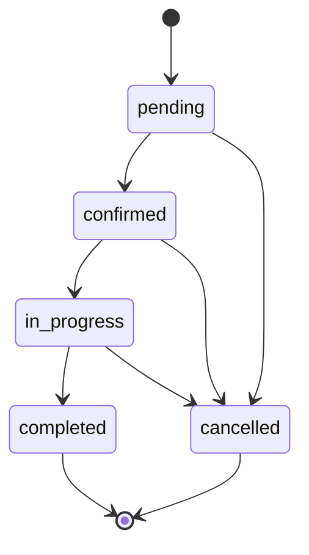

# BOOKING — Luồng nghiệp vụ, concurrency và trạng thái

Đặc tả này rút trực tiếp từ `src/modules/appointments/appointments.service.ts`, DTO/entity và `frontend/src/components/booking/BookingForm.tsx`.

## 1. Customer booking

1. Xác thực user role `customer` hoặc `admin` (admin cũng có thể tự đặt qua luồng public).
2. Chọn branch, một hoặc nhiều services thuộc **cùng branch** và `booking_enabled=true` có `duration_minutes`.
3. Chọn số khách (`party_size`) và ngày; frontend gọi availability trước khi cho chọn giờ.
4. Backend trả các start slots mà **ít nhất `party_size` nhân viên của branch cùng rảnh**.
5. Khách chọn 1 giờ 15-phút-aligned, nhập số điện thoại, gửi POST booking.
6. Backend **tự phân nhân viên**, customer không được gửi `staff_id`, `user_id`, `customer_email`.
7. Booking được commit với `status=pending`; frontend hiển thị mã và tổng tiền dự kiến.

Thời lượng ca = tổng `duration_minutes` của các service (một chuỗi dịch vụ mỗi khách). Giá dự kiến = tổng giá snapshot các dịch vụ **nhân `party_size`**.

## 2. Giới hạn thời gian & availability

| Rule | Code hiện hành |
|---|---|
| Timezone | `Asia/Ho_Chi_Minh`, UTC+07:00 |
| Giờ mở cửa dùng tính booking | **09:00–20:30** |
| Bước giờ bắt đầu | **15 phút** |
| Booking tối thiểu trước giờ hẹn | **3 giờ** |
| Booking xa nhất | **14 ngày** |
| Pending của mỗi user | Tối đa **3 booking groups** |
| Điều kiện trùng thời gian | `existing.start < proposed.end && existing.end > proposed.start` |
| Buffer | **Không có**; chỉ xét `[start_time, end_time)` |
| Active statuses chiếm slot | `pending`, `confirmed`, `in_progress` |

`branches.opening_hours` là trường hiển thị, **không tự quyết định giờ booking**; cần thay logic trong service nếu muốn vận hành giờ riêng cho từng branch. Availability chỉ là snapshot tại thời điểm GET, không phải reservation.

## 3. Atomic reservation & group booking

- Transaction `AppDataSource.transaction` khóa record owner (`pessimistic_write`) để đếm booking pending và hạn chế race của cùng user.
- Vòng lặp candidate staff: loại staff có lịch overlap; thử insert các `StaffBookingSlot` ứng với mọi mốc 15 phút từ start đến trước end.
- DB `staff_booking_slots` có primary key `(staff_id, slot_start)`; insert trùng nhận `ER_DUP_ENTRY` và thử staff khác.
- Thiếu số nhân viên cần thiết → rollback transaction và trả `409 SLOT_UNAVAILABLE`.
- Khi đủ nhân viên: tạo một `bookingGroupId` UUID, insert **một appointment cho mỗi staff** với group ID chung và snapshots.
- Một booking nhóm trả **appointment đầu tiên** trong HTTP 201; cả nhóm chia sẻ mã booking nhưng từng appointment có ID riêng.
- Không dùng khóa frontend hay đơn thuần kiểm tra trống rồi save mà không reserve slot.

**Ví dụ:** Nhóm 2 người, mỗi người 60 phút, từ 10:00 → 11:00. Hai staff được giữ các slot 10:00, 10:15, 10:30, 10:45; không được double-book cùng staff/slot.

## 4. Mã lịch hẹn

UI hiển thị:

```text
(createdAppointment.booking_group_id ?? createdAppointment.id).slice(0, 8).toUpperCase()
```

Admin tìm bằng `booking_code` (1–8 ký tự hex), case-insensitive, so theo **tiền tố `booking_group_id`**, hoặc `appointment.id` nếu legacy row có `booking_group_id IS NULL`. Tìm kiếm thực hiện trên DB trước phân trang. Vì chỉ là **mã ngắn** chứ không phải UUID duy nhất tuyệt đối, admin phải xác nhận thêm tên khách, ngày/chi nhánh nếu trùng tiền tố hiếm gặp.

Bảng admin hỗ trợ `from` và `to` query ISO timestamps: `from` inclusive, `to` exclusive. UI chọn ngày Việt Nam và dùng 00:00 ngày sau cho giới hạn trên (bao trọn ngày kết thúc).

## 5. Vòng đời trạng thái



- `pending → confirmed`: kiểm tra staff/branch còn hợp lệ.
- `confirmed → in_progress`: chỉ khi `now >= appointment.start_time`; lưu `actual_started_at`. Nếu quá sớm → **409 `APPOINTMENT_NOT_STARTED_YET`**.
- `in_progress → completed`: tương tự không trước start; lưu `actual_completed_at`.
- `cancelled`/`completed`: terminal; không cho chuyển trạng thái tiếp.
- Khi terminal: release các reserved slots. Khi thay đổi lịch hợp lệ (thời gian/staff/services) phải release/reserve lại trong transaction.
- STAFF chỉ được start/complete lịch của mình, không được đổi staff/services/start; ADMIN có quyền sửa với các guard của service.
- Customer không có quyền PUT appointment (UI hướng dẫn liên hệ tiệm để hủy/đổi).

## 6. Thông báo email sau booking

`createAppointment` gọi `notifyAdminsOfNewBooking` **sau DB commit**. Service chọn user `role=admin` với email, bỏ trùng địa chỉ và gửi mỗi admin **một email cho booking group**. Subject hiện tại:

```text
Serpente Nail Room - Có khách hàng vừa đặt lịch
```

Nội dung có UUID nhóm, trạng thái, khách, chi nhánh, thời gian, nhân viên, dịch vụ và tổng dự kiến.

Email là **best-effort fire-and-forget**: Gmail lỗi không rollback booking. Chưa có queue/outbox hoặc retry bền vững, vì vậy cần log/monitoring nếu yêu cầu độ tin cậy cao. OTP cũng dùng Gmail sender nhưng là luồng khác.

## 7. Trường hợp kiểm thử cần giữ

- Hai requests đồng thời đặt **cùng staff + slot**: không thể cùng thắng.
- Đặt hai lịch sát nhau (09:00–09:15 và 09:15–09:30): **không overlap**.
- Service thuộc các branch khác nhau: reject.
- Dịch vụ thiếu duration hoặc disabled: reject.
- Group size lớn hơn staff trống: không tạo partial booking.
- Không được gửi `staff_id` từ public form.
- Max 3 pending booking groups.
- Không được chuyển `confirmed → in_progress` trước start.
- Terminal/cancel release slots, nhưng không được vô ý xóa lịch sử.
- Mã frontend phải khớp mã search admin.

Xem [API](API.md) và [DATABASE](DATABASE.md).
