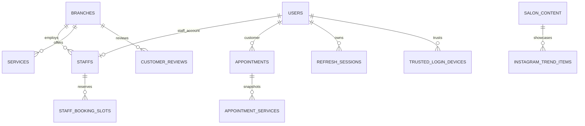

# DATABASE — MySQL, entities và migration

Source: `src/config/database.ts`, `src/modules/**` (entities) và `src/migrations`. DB là **MySQL 8**; TypeORM `timezone: "Z"`. Không dùng TypeORM `synchronize` tại production; production `src/server.ts` chặn start khi còn pending migrations.

## Sơ đồ quan hệ nghiệp vụ



Sơ đồ biểu đạt mối liên hệ **logic**; không phải mọi liên hệ đều có DB foreign key. Ví dụ lịch giữ snapshot nhân viên/khách và `appointment_services` chủ động dùng `createForeignKeyConstraints: false`.

## Entities chính

| Bảng | Khóa và trường quan trọng | Ý nghĩa |
|---|---|---|
| `users` | `id` UUID, unique nullable `email`, `phone`, `password_hash`, `role`, `token_version` | ADMIN/STAFF/CUSTOMER |
| `branches` | `id` int, `name`, `address`, `phone`, `opening_hours` | Chi nhánh |
| `staffs` | PK/FK `user_id`, `branch_id` | User role STAFF thuộc một branch |
| `services` | `id` UUID, `branch_id`, `name`, `price`, `duration_minutes`, `booking_enabled`, category/description | Dịch vụ theo branch |
| `appointments` | `id`, `user_id`, `booking_group_id`, `party_size`, customer/staff/branch snapshots, `start_time`, `end_time`, actual times, `status` | Mỗi bản ghi dành cho một staff |
| `appointment_services` | PK (`appointment_id`, `service_id`), `service_name`, `price`, `duration_minutes` | Giá/dịch vụ tại thời điểm đặt |
| `staff_booking_slots` | **PK ghép** (`staff_id`, `slot_start`) | Chống đặt trùng ở độ phân giải 15 phút |
| `media_files` | `id` UUID, unique `object_key`, `original_name`, `mime_type`, `byte_size`, `created_by`, `created_at` | Metadata ảnh riêng tư lưu trên Cloudflare R2 |
| `offers` | `id`, `name`, `details`, `start_date`, `end_date`, `image`, `sort_order` | Khuyến mãi |
| `salon_content` | `id` int, tên/links/contacts/branding flags | Dữ liệu công khai của salon |
| `instagram_trend_items` | `salon_content_id`, `image_src`, `instagram_url`, `sort_order` | Trending images |
| `customer_reviews` | `branch_id`, `display_name`, `content`, `source`, `source_url`, `sort_order` | Đánh giá theo branch |
| `audit_logs` | `event_type`, `user_id`, `request_id`, identifier/IP/UA hashes, timestamps | Log bảo mật/requests |
| `refresh_sessions` | `user_id`, `family_id`, `token_hash`, `expires_at`, `revoked_at`, `replaced_by`, fingerprint | Refresh token rotation |
| `trusted_login_devices` | `user_id`, `token_hash`, `token_version`, role/UA hash, expiry/revocation | OTP trusted browser |
| `login_mfa_challenges` | `user_id`, `code_hash`, `attempts_remaining`, `expires_at`, `consumed_at` | OTP đăng nhập |
| `registration_email_challenges` | `email`, `code_hash`, số lượt/hạn dùng | OTP đăng ký |
| `password_reset_challenges` | `user_id`, code hash, số lượt/hạn dùng | Reset password |
| `password_change_challenges` | `user_id`, code hash, số lượt/hạn dùng | Change password |

## Index và sự nhất quán

- `appointments`: index `(user_id, start_time)`, `(staff_id, start_time)`, `booking_group_id`.
- `staff_booking_slots`: composite primary key `(staff_id, slot_start)` là cơ chế **atomic uniqueness** khi nhiều requests cùng chọn giờ; không thay thế bằng mutex ở frontend.
- `trusted_login_devices`: index `(user_id, expires_at)`, unique `token_hash`.
- `refresh_sessions`: index `(user_id, family_id)`, unique `token_hash`.
- `audit_logs`: composite indexes phục vụ rate limits/tra cứu hash và `request_id`.
- Các entities content có index theo parent và sort order.

**Lưu ý lịch nhóm:** API tạo `party_size` bản ghi `appointments`, mỗi staff có snapshot service riêng. Thống kê yêu cầu pending tối đa 3 dùng `COUNT(DISTINCT COALESCE(booking_group_id, id))`, không đếm trùng thành viên nhóm.

## Snapshot và delete

Lịch giữ `customer_full_name/phone/email`, `staff_full_name`, `branch_name/address` và snapshot service. Khi sửa/xóa user, staff, service hoặc branch, cần giữ semantics lịch sử theo migration và service. Admin `DELETE /api/appointments/:id` xóa thực một appointment và giải phóng slot. Trong khi đó, chuyển trạng thái sang `cancelled` giữ bản ghi lịch để phục vụ tra cứu lịch sử; hai thao tác có ngữ nghĩa dữ liệu khác nhau.

## Migrations hiện có

Theo thứ tự filename trong `src/migrations`:

1. `1790982346696-InitialSchema.ts`
2. `1791260400000-AddOffers.ts`
3. `1791260800000-SeedInitialOffers.ts`
4. `1791313200000-HardenAuthentication.ts`
5. `1791397000000-UnifyAuditLogs.ts`
6. `1791403200000-HardDeleteSnapshots.ts`
7. `1791414000000-AddGroupBookings.ts`
8. `1791421200000-LoadRealSalonData.ts`
9. `1791434400000-NormalizeSiteContentItems.ts`
10. `1791438000000-BranchReviewsAndReseedTrends.ts`
11. `1791441600000-CorrectInstagramTrendItems.ts`
12. `1791445200000-EmailAuthenticationBookingPhone.ts`
13. `1791448800000-RegistrationOtpRememberSession.ts`
14. `1791449000000-TrustedLoginDeviceOtp.ts`
15. `1791452400000-AddMediaFiles.ts`

Tên file mô tả phạm vi, không thay thế việc đọc nội dung migration khi rollback/cutover.

```bash
npm ci
npm run build
npm run migration:show
npm run migration:run
```

Trên production, backup DB trước migration, dùng `DB_SYNCHRONIZE=false`. Không chạy `migration:run` khi schema DB đã được auto-sync theo cách không khớp migration history mà chưa đối chiếu bảng `migrations`.

## Retention

Script `src/jobs/retention-cleanup.ts` dọn:

- `audit_logs` quá 90 ngày;
- `login_mfa_challenges` và `password_reset_challenges` quá 7 ngày; script **không** dọn `registration_email_challenges` hay `password_change_challenges`.
- `refresh_sessions`, `trusted_login_devices` hết hạn hoặc đã revoke quá 30 ngày.

VPS Compose có service `retention` chạy theo chu kỳ 24 giờ. Cấu hình scheduler tương ứng trên Railway không nằm trong repository; cần kiểm tra cấu hình runtime nếu sử dụng môi trường này. Script retention không xóa dữ liệu booking/khách hàng.

Xem [BOOKING](BOOKING.md) để hiểu slot reservations và [DEPLOYMENT](DEPLOYMENT.md) để migrate/backup an toàn.
