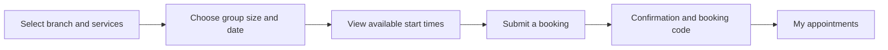

# Serpente Nail Room — Product tour

**Live application:** https://nail-salon-web-v2.vercel.app/

Serpente Nail Room provides a public service catalog, customer appointment booking, and an access-controlled operations dashboard. The public pages are available without signing in; booking and management workflows require an authenticated account.

## Public website

| Page | Description |
|---|---|
| [Home](https://nail-salon-web-v2.vercel.app/) | Salon introduction, promotional content, nail-design gallery, customer reviews and location information |
| [Services](https://nail-salon-web-v2.vercel.app/services) | Service catalog with category filters, descriptions and pricing |
| [Booking](https://nail-salon-web-v2.vercel.app/book) | Selection of services, group size, date and available start time; authentication is required to submit a booking |

## Customer appointment flow

The customer chooses a **time slot**, not an employee. The API assigns eligible staff and reserves 15-minute intervals in a database transaction. A successful reservation displays the selected branch, date and time, services, party size, estimated total, status and short booking reference.

## Appointment administration

The [admin sign-in page](https://nail-salon-web-v2.vercel.app/admin/login) leads to a role-restricted dashboard for authorized staff. Its appointment table supports filtering by branch, status and date range, and searching by the same short booking reference shown to the customer. Appointments advance through server-validated states from pending to completion or cancellation.

## Supporting implementation

- [Concurrency-safe booking design](BOOKING.md) — staff assignment, group reservations and lifecycle constraints.
- [API contract](API.md) — booking and administrative endpoints, authentication and filters.
- [Engineering case study](PORTFOLIO.md) — database concurrency, session security and transaction boundaries.
- [CI workflow](../.github/workflows/security-hardening-ci.yml) — automated TypeScript builds, security checks and real-MySQL concurrency regression tests.

---

**Application access:** Public catalog routes are open. Customer bookings require customer authentication; the management dashboard requires an administrator account.
